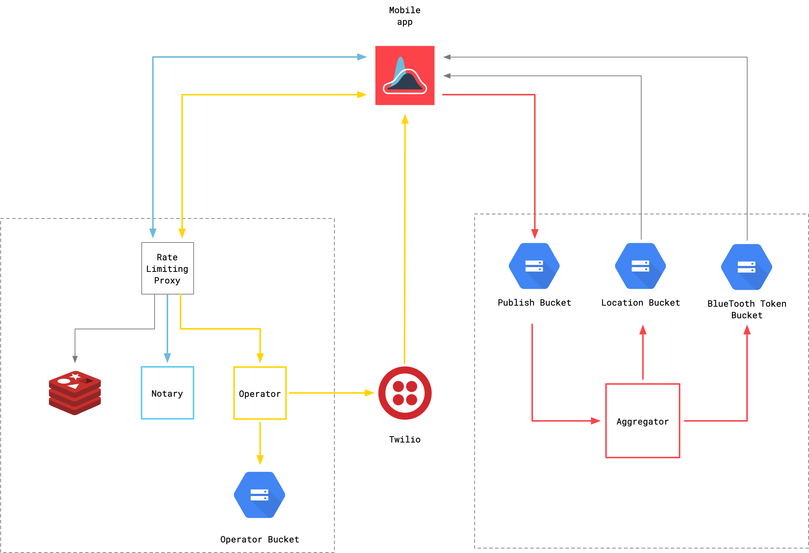

# covidtrace/docs

This repository holds general documentation for the COVID Trace app and architecture. If you intend to deploy a version of COVID Trace, this is a good starting place.

## The App

The COVID Trace mobile application is built using Flutter. The source code is available at [covidtrace/app](https://github.com/covidtrace/app).

Configuration for both the app and the backend is provided via a single JSON file that must be publicly available via HTTPS. The current configuration file is [available here](https://storage.googleapis.com/covidtrace-config/config.json) for reference.

## Backend Services

COVID Trace depends heavily on Google Cloud Platform components. As such, deploying to a different cloud provider will require both code changes and architectural changes.

Services are deployed from the code in the repositories below. In general, services are built into Docker containers and executed using Google Cloud Run.
This provides an exceedingly simple way to run scalable stateless services.

- [covidtrace/aggregator](https://github.com/covidtrace/aggregator)
- [covidtrace/operator](https://github.com/covidtrace/operator)
- [covidtrace/notary](https://github.com/covidtrace/notary)
- [covidtrace/proxy](https://github.com/covidtrace/proxy) (technically optional, though highly recommended for safety)

## A New Deployment

At a high level, to deploy a new version of COVID Trace you must handle all of the following. This includes instructions for deploying the proxy as it is highly recommended.

- Create a new Google Cloud Platform Project
- Create and fund a Twilio account
	- Reserve a mobile phone number to use for SMS
	- Obtain the account SID and API access token
- Create Cloud IAM Service Accounts
	- A “notary” service account to handle signing Cloud Storage Upload URLs
	- A “cloudscheduler” service account (which may already exist) to handle invoking the Aggregator Cloud Run service
- Create several Cloud Storage buckets
	- An “Operator” bucket for the Operator service to store metadata
	- A “Location” bucket for user generated location data
		- Give “Object Creator” access to the “notary” service account
	- A “BlueTooth token” bucket for user generated BlueTooth beacon/token data
		- Give “Object Creator” access to the “notary” service account
	- A “Publish” bucket for the anonymized aggregated public data
		- Give “Object Viewer” access to “allUsers” to ensure the data is publicly available
- Create a Cloud Memorystore (Redis) instance
- Create a “Serverless VPC Access” instance to provide private connectivity from the Proxy Cloud Functions and the aforementioned Memorystore instance
- Create Cloud Run services for Operator, Notary, and Aggregator ensuring they require authentication to invoke
	- View each repository for relevant environment variables
	- Take note of the service URLs to use when configuring the Proxy Cloud Functions
- Create Cloud Scheduled Tasks for Aggregator service making sure to configure the Auth Header as OIDC token using the “cloudscheduler” service account and the full HTTP URL as the “audience”
	- An aggregate task that makes an HTTP POST to `https://operator-cloud-run-url.app/aggregate` once an hour on the hour
	- A hinting task that makes an HTTP POST to `https://operator-cloud-run-url.app/hinting` once an hour on the half hour
- Create the Proxy Cloud Functions making sure to use the Cloud Run service URLs obtained earlier and the private IP address of the aforementioned Memorystore instance
- Create a configuration file and host it somewhere publicly accessible via HTTPS, including references to the buckets and Cloud Functions created earlier
- Point the app at the aforementioned config file, build and debug